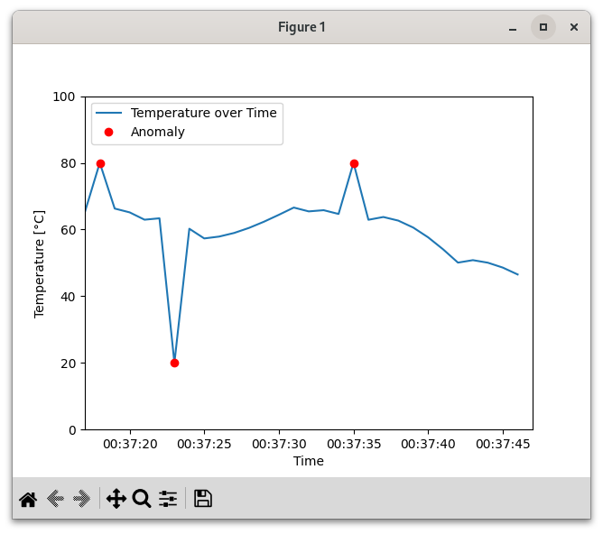

# What is this

it's a **system monitoring simulation**. It simulates the reading **temperature** sensor from a system which is represented as a floating number, presented in a continuous data stream.

as those data come, they will be **processed by anomaly detectors**, which will mark it whether it's an anomaly or not.

this system monitoring will be displayed **as a graph** in real-time. the graph will show the **data stream as a line**, and the **anomaly as a red dot**.



**documentation** of generation of the data and the detector **can be found in the respective folder**.
## why temperature data?
- it **checks off the requirement** for this projects
- it's what I'm **familiar** with, so I have a better understanding of how the data should behave, and possible anomaly that might occur. by doing this I also **represent real world scenario as close as possible**.
# setup

I uses python 3.12. not tested with any other python version.

0. Recommended to use virtual enviroment to keep everything local. to do it,

```bash
python -m venv .venv # to create the local environment
source .venv/bin/activate # to activate the environment
deactivate # to deactivate the environment
```

to use the virtual environment, active it first before you install and run the code. then deactivate it when you are done.

1. install the requirement using

```bash
pip install -r requirements.txt 
```
or install pandas and matplotlib manually

```bash
pip install pandas matplotlib
```

2. to run

```bash
python src/main.py
```

3. to test

```bash
 python -m unittest
```
